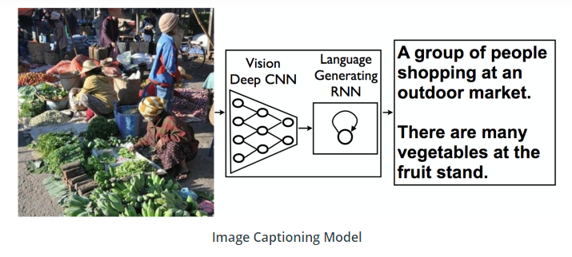

# Project : Image Captioning

## Description
In this project I combine Convolutional Neural Networks (CNN) and Recurrent Neural Networks (RNN) knowledge to build a deep learning model that produces captions given an input image. 

Image captioning  deep learning model consists of two components: 
a CNN that transforms an input image into a set of features, 
a RNN that turns those features into rich, descriptive language.

One such example of how this architecture performs is pictured below: 
<!--  -->

  

## Files
* `Dataset`: Explore the MS COCO dataset 
* `Preliminary`: Load and pre-process data from the MS COCO dataset 
* `Training`: Training phase of the CNN-RNN model 
* `Inference`: Using the trained model to generate captions for images in the test set.
* `data_loader.py` : Custom data loader for PyTorch combining the dataset and the sampler.
* `model.py` : CNN-RNN architecture for automatically generating image captions
* `vocabulary.py` : Vocabulary constructor built from the captions in the training dataset
* `vocab.pkl` : Vocabulary file stored to load it immediately from the data loader
